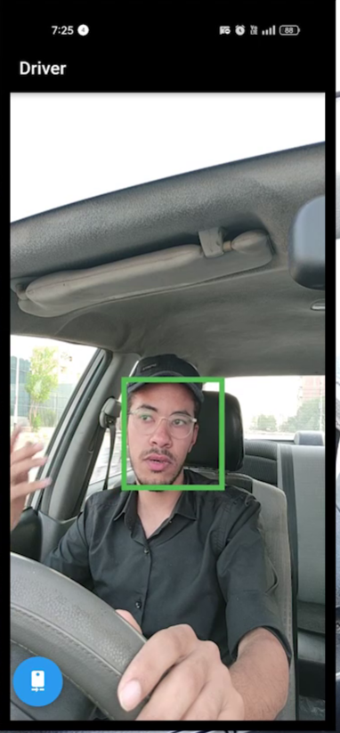

# Drive-Safe

  

A flutter app that protects drivers from drowsiness by monitoring their eyes and sounding an alarm if the eyes are closed.

## Table of Contents  
1. [Features](#features)  
2. [Video Demo & Screenshots](#screenshots)  
3. [Installation](#installation)  
4. [Technologies Used](#technologies-used)

## Features  
- High accuracy detecting the state of your eyes  
- Fast feedback : The alarm starts after only one second of Sleepiness/Drowsiness detection  
- Lightweight app.

## Video Demo

## Screenshots  

  
    

## Installation
Google Drive Link (Apk file):
https://drive.google.com/file/d/12RtKkiRLeJGLI2CABbtr_F_2Mz2gHnmv/view?usp=drive_link

## Technologies used
- Flutter 3.0
- Google MLkit for Computer vision

## Future Contributions 
Here's a link to a google doc that contains all about the project. Most importantly, the problems that needs to be solved...So if you can help, please contact me.
https://docs.google.com/document/d/1JhM2ZferfcHiuTA-qRJtgf7DdoV7-A5mPwNWkeZDYmo/edit?usp=sharing
